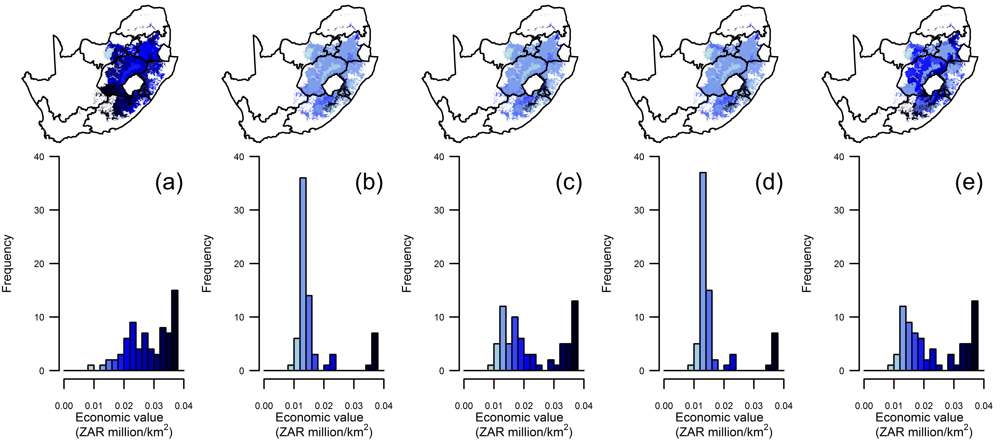

# Mitigating biodiversity loss

As human development affects biodiversity, conservation scientists are trying to figure out ways to mitigate these negative impacts and, if necessary, compensate for biodiversity loss with comparable gains elsewhere. My work combines ecological theory and GIS to better understand how ecological dynamics affect the feasibility of successful mitigation.

## Ecological resilience and the mitigation hierarchy
Along with [Susie Brownlie of deVilliers Brownlie Associates](https://www.dbass.co.za/our-team/), I developed a time-delayed differential model to understand how mitigation delays lead to prolonged biodiversity loss. 

In simple language, because mitigation is applied on a project-by-project basis, it only compensates for *direct* impacts. *Indirect* impacts, like reduced ecological resilience, remain unmitigations.

When there are long delays between the impact and the mitgation, reduced ecological resilience can cause biodiversity losses that last for decades after project-level mitgation is completed successfully.

* **Buschke, F.T.** & Brownlie, S. (2020) Reduced ecological resilience jeopardizes zero loss of biodiversity using the mitigation hierarchy. *Nature Ecology & Evolution*, **4**, 815–819. ([Link](https://www.nature.com/articles/s41559-020-1177-7))
* 2020 Popular article: [Reduced ecological resilience jeopardizes zero loss of biodiversity](https://natureecoevocommunity.nature.com/posts/65050-reduced-ecological-resilience-jeopardizes-zero-loss-of-biodiversity). *Nature community blog*

## Protected area expansion through biodiversity offsets
Biodiversity offsets have been considered as a possible mechanism to fund protected area expansion in developing countries. With [Susie Brownlie of deVilliers Brownlie Associates](https://www.dbass.co.za/our-team/) and [Jeff Manuel of SANBI](https://www.linkedin.com/in/jeffrey-manuel-89628a72/?originalSubdomain=za), I simulated whether South Africa can meet the [Aichi protected area target](https://www.cbd.int/aichi-targets/target/11) using biodiversity offsets.

We showed that the best economic and conservation outcomes occured by combining public investment in protected areas with mitigation from private sector development. 

* **Buschke, F.T.**, Brownlie, S. & Manuel, J. (2019) The conservation costs and economic benefits of using biodiversity offsets to meet international targets for protected area expansion. *Oryx*, **53**, 732-740. ([Link](https://www.cambridge.org/core/journals/oryx/article/conservation-costs-and-economic-benefits-of-using-biodiversity-offsets-to-meet-international-targets-for-protected-area-expansion/C852F8EA271C84E01BFF6BD8F52A0BEC))

## Spatial and temporal dynamics and acheiving no net loss
No net loss assumes that the losses of biodiversity at one locality can be compensated for by equivalent gains somewhere else. But biodiversity is not always commensurable. My work, in collaboration with [Sam Sinclair of Biodiversify](https://www.biodiversify.org/about), demonstrated how the geographic configuration and temporal feedbacks of biodiversity can jeopardise no net loss outcomes, even when mitigation is implemented perfectly.

* **Buschke, F.T.** & Sinclair, S.P. (2019) Adding ecological and evolutionary processes to biodiversity offset models using neutral theory. *Diversity and Distributions*, **25**, 1351-1361. ([Link](https://onlinelibrary.wiley.com/doi/full/10.1111/ddi.12943))
* **Buschke, F.T.** (2017) Biodiversity trajectories and the time needed to achieve no net loss through averted-loss biodiversity offsets. *Ecology Modelling*, **352**, 54-57. ([Link](https://www.sciencedirect.com/science/article/pii/S0304380016304719))

