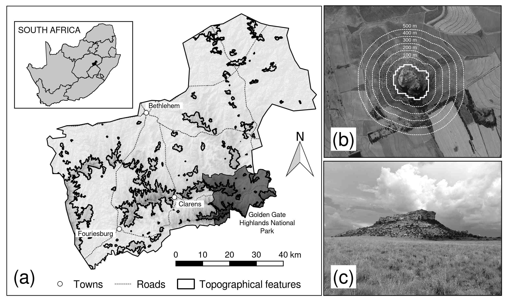

# Biodiversity conservation in agricultural landscapes

Agricultural is the predominant land-use across the planet. So, the future of biodiversity depends on whether plants and animals can live alongside farming activities.

## Identifying ecological refuges
Ecological refuges are safe-havens for plants and animals from the effects of land-use and climate change. In partnership with [Bram Vanschoenwinkel of the Vrije Universiteit Brussels](https://insularecology.com/) and [Carina Pienaar of BirdLife SA](https://www.birdlife.org.za/what-we-do/landscape-conservation/meet-the-team/), I explored whether rocky outcrops are ecological refuges in central South Africa.

We found that mountians and outcrops are important keystone habitats for butterfly species in this landscape. Butterflies were able to retreat to these habitats during periods of drought, and then recolonise the landscape once conditions improved.

* **Buschke, F.T.**, Coetzer, C. Pinceel, T. Mehlomakhulu, Z. Moreels, N., du Randt, L. & Vanschoenwinkel, B. (2020) Mountains and rocky
outcrops as ecological refuges in a high biodiversity working landscape. *Biological Conservation*,**250**, 108759. ([Link](https://www.sciencedirect.com/science/article/pii/S000632072030817X))
* **Buschke, F.T** (2019) Mountains and rocky outcrops as ecological refugia in a high biodiversity agriculture landscape. *29th International
Congress for Conservation Biology. 21-25 July, Kuala Lumpur, Malaysia*.
* 2020 Popular article: [Free State mountains shield biodiversity from climate change, FBIP study shows](https://fbip.co.za/news/mountains-shield-biodiversity-from-climate-change/). Foundational Biodiversity Information Programme
* **Dataset of Global Biodiversity Infomation Facility**: [FBIP: The effect of land-use on the butterfly diversity of ecological refugia within an agricultural landscape](https://www.gbif.org/dataset/9b39760c-6b42-468e-9059-9f1a5d65f490/activity) 

## Mammal diversity in response to changing land-use
I carried out a camera-trap study to explore how mammals used habitat after the removal of livestock. Results showed that mammal species richness in abandonded farmland was comparable to adjacent protected areas. Moreover, species have not adjusted their daily behavioural patterns in response to the closer proximity to humans. Combined, this shows how mammal species can potentially recolonise farmland that is managed using more biodivesity-friendly methods.

* **Buschke, F.T.** (2016) A camera trap survey of nocturnal mammals on former farmland in the eastern Free State Province, South Africa, 10 years after removing livestock. *African Journal of Ecology*, **54**, 514-518. ([Link](https://onlinelibrary.wiley.com/doi/abs/10.1111/aje.12293))

### Funded by:
* South African National Biodiversity Institute FBIP Program (Grant no:FBIS160505164165) 
* South Initative from the Flemish Interuniversity Council VLIR-UOS (Grant no:ZA2019SIN261)
